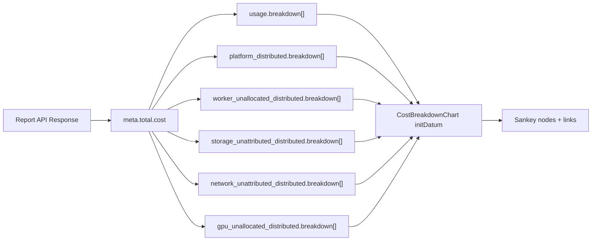

# Frontend Implementation: Cost Breakdown for Custom Costs (Phase 1)

**PRD Reference:** [PRD04 COST-2105 / COST-4415](https://github.com/project-koku/koku/blob/main/docs/architecture/prd04-cost-breakdown/README.md)
**Backend Detailed Design:** [DD04](https://github.com/project-koku/koku/blob/main/docs/architecture/prd04-cost-breakdown/DETAILED_DESIGN.md)
**Phase:** Phase 1 (COST-2105)
**Repository:** koku-ui (this repo)
**Last updated:** 2026-02-16

---

## Scope

Three PRD acceptance criteria (frontend):

1. Rate creation/editing form includes the `name` field (required, max 50 chars)
2. Sankey diagram renders individual rate names as new nodes on the **left** side, flowing into the existing cost category nodes
3. Overhead types (platform distributed, worker unallocated, etc.) receive flow from constituent rate-name nodes on their left

All work is in `apps/koku-ui-hccm/src/`.

### Design Notes

- **Sankey flow direction:** The existing chart uses a parts-to-total composition direction (left-to-right): individual cost categories on the left compose into aggregates on the right, culminating in "Total cost" on the far right. The new rate-name layer is added as the **leftmost** column, preserving this direction.
- **Phase 1 scope:** Only `usage` and the five overhead types (`platform_distributed`, `worker_unallocated_distributed`, `storage_unattributed_distributed`, `network_unattributed_distributed`, `gpu_unallocated_distributed`) gain `breakdown` arrays. `raw`, `markup`, and `credit` remain unchanged (no breakdown sub-layer in Phase 1; cloud service breakdown is Phase 2).
- **Cross-cost-model aggregation:** When multiple cost models apply to the same cluster and both define a rate with the same name (e.g., "JBoss subscription"), the backend aggregates them via GROUP BY. The Sankey displays a single node per unique rate name, which is the correct behavior.
- **Per-data-row breakdown:** The backend also attaches `breakdown` arrays to each row in `data[]` (per date, per group-by entity), not just `meta.total.cost`. The Sankey chart only reads the total-level breakdown. The per-row data is available for potential future use (e.g., detailed tables).
- **Credit node:** The existing Sankey has a "credit" node (cloud provider credits) that links directly to "Total cost" in the non-distributed view. Credits are only shown when `costDistribution` is NOT `'distributed'`. Since the breakdown feature operates in the distributed view (which is where overhead categories are visible), the credit node is not affected by our changes.

---

## Part A: Rate Name Field in Cost Model Editor

The backend already enforces `name` as mandatory on `RateSerializer`. The frontend must send it and display it.

### A1. API types — add `name` to Rate interfaces

- `api/rates.ts`: Add `name: string` to `RateRequest` (line 6) and `Rate` (line 27). Both currently lack a top-level `name` (only `metric.name` exists, which is a different field).

### A2. Rate form state — add `name` to form data

- `routes/settings/costModels/components/rateForm/utils.tsx`:
  - Add `name: ''` to `initialRateFormData` (line 26)
  - Add `name: textHelpers.required` to `initialRateFormData.errors` (line 44)
  - In `genFormDataFromRate()` (line 90): populate `name: rate.name || ''`
  - In `transformFormDataToRequest()` (line 185): add `name: rateFormData.name` to the returned object
  - Add `nameErrors()` validation function: required, max 50 chars, unique within cost model. **Uniqueness check:** compare against `rateFormData.otherTiers` (the form already receives other rates in the cost model via the `tiers` parameter in `genFormDataFromRate(rate, defaultValue, tiers)`, stored as `otherTiers: Rate[]`). Check `otherTiers.some(t => t.name === candidateName && t !== currentRate)`.

### A3. Rate form reducer — handle name updates

- `routes/settings/costModels/components/rateForm/useRateForm.tsx`:
  - Add `UPDATE_NAME` action type to the `Actions` union
  - Handle it in `rateFormReducer`: update `state.name` and `state.errors.name` (call `nameErrors()`)

### A4. Rate form UI — render the name input

- `routes/settings/costModels/components/rateForm/rateForm.tsx`:
  - Add a `SimpleInput` for `name` (required, max 50 chars) rendered **above** the `description` field
  - The `name` field should be the first user-visible text input (it's the primary identifier)
  - Wire to `rateFormData.setName` / `rateFormData.name` / `rateFormData.errors.name`

### A5. Rate form submit validation

- `routes/settings/costModels/components/rateForm/canSubmit.tsx`:
  - Add `errors.name` to the `canSubmit` check (form cannot submit if `errors.name` is non-null)
  - For `tagging` mode, add `rateFormData.errors.name === null` to the condition
  - For `regular` mode, add `rateFormData.errors.name === null` to the condition

### A6. Rate table — display name column

- `routes/settings/costModels/components/rateTable.tsx`: This is the component that renders the actual table columns (imported by `priceListTable.tsx`).
  - Add a "Name" column to the main `columns` array (before the existing "Metric" column, at index 0)
  - Read `rate.name` from the rate data in the row renderer
  - The `RateTable` component accepts `tiers: Rate[]` — once `Rate` gains the `name` field (A1), the data flows through automatically.

### A7. Localization

- `locales/messages.ts`:
  - Add messages: `rateName` ("Rate name"), `rateNameRequired` ("Rate name is required"), `rateNameTooLong` ("Rate name must be 50 characters or less"), `rateNameDuplicate` ("Rate name must be unique within this cost model")

### A8. Tests

- `routes/settings/costModels/components/rateForm/useRateForm.test.tsx`:
  - Add test: `UPDATE_NAME` sets name and clears error
  - Add test: `UPDATE_NAME` with empty string sets required error
  - Add test: `UPDATE_NAME` with >50 chars sets too-long error
  - Add test: `UPDATE_NAME` with duplicate name (already in `otherTiers`) sets duplicate error
  - Add test: `transformFormDataToRequest` includes `name` in output
  - Add test: `genFormDataFromRate` populates `name` from rate

---

## Part B: Sankey Diagram Per-Rate Breakdown

The backend API now returns `breakdown` arrays on `usage` and overhead cost categories. The Sankey must consume these to add a new layer of nodes on the **left** side.

### B1. API types — add `breakdown` to ReportValue

- `api/reports/report.ts`:
  - Add `BreakdownEntry` interface:

```typescript
export interface BreakdownEntry {
  name: string;
  source: 'rate' | 'service' | 'cloud' | 'other';
  value: number;
  units: string;
}
```

  - Extend `ReportValue` (line 3) to add `breakdown?: BreakdownEntry[]`

Note on `source` values: In Phase 1, the backend returns `"rate"` (cost model rate names), `"cloud"` (aggregated cloud cost placeholder in overhead), and `"other"` (top-N remainder aggregation). `"service"` is reserved for Phase 2 cloud service breakdown.

### B2. Sankey chart — consume breakdown data

- `routes/details/components/costBreakdownChart/costBreakdownChart.tsx`:
  - This is the main change. The current distributed-mode Sankey has 4 layers:
    - Layer 1 (left): Cost categories — `Raw cost`, `Markup`, `Usage cost`, `Platform distributed`, `Worker unallocated`, `Storage unattributed`, `Network unattributed`, `GPU unallocated`
    - Layer 2 (middle-left): `Project (All other costs)` (workload), `Overhead cost`
    - Layer 3 (middle-right): `Total cost`
    - (Layer 3 is the rightmost node)
  - After the change, it has 5 layers (a new leftmost layer for rate names):
    - **Layer 0 (new, leftmost):** Rate name nodes (e.g., "JBoss subscription", "Guest OS subscription", "Quota charge", "Cloud cost")
    - Layer 1: Cost categories — `Raw cost`, `Markup`, `Usage cost`, `Platform distributed`, `Worker unallocated`, etc.
    - Layer 2: `Project (workload)`, `Overhead cost`
    - Layer 3: `Total cost`

Flow direction remains left-to-right (parts compose into aggregates):

```
JBoss subscription --------\
Guest OS subscription ------+--> Usage cost -------\
Quota charge --------------/                       |
                                                   |
                              Raw cost ------------+--> Project (workload) --\
                              Markup --------------/                         |
                                                                            +--> Total cost
JBoss subscription -----\                                                   |
Quota charge -----------+--> Platform distributed --\                       |
Cloud cost ------------/                            |                       |
                                                    +--> Overhead cost -----/
JBoss subscription -----\                           |
Quota charge -----------+--> Worker unallocated ---/
Cloud cost ------------/                           |
                              Storage unattributed-/
                              Network unattributed/
```

**Note on the diagram above:** Each rate name (e.g., "JBoss subscription") that appears in multiple categories is rendered as **separate nodes** in the Sankey — one per category. For example, "JBoss subscription" appears three times: once flowing into "Usage cost", once into "Platform distributed", and once into "Worker unallocated". Internally, each is a distinct ECharts node with a unique ID (`JBoss subscription\u200BUsage cost`, etc.) but the label displays just "JBoss subscription".

**IMPORTANT — Separate nodes per target:** When a rate name (e.g., "JBoss subscription") flows into multiple category nodes (e.g., "Usage cost" AND "Platform distributed"), it must appear as **separate nodes** on the left — one per target. ECharts requires unique node names, so each node uses an internal ID of `${rateName}\u200B${targetLabel}` (zero-width space separator) while displaying just the rate name via `_displayName`. This avoids the visual issue of a single bar splitting into multiple targets.

Concretely, in `initDatum()`:

- Read `report.meta.total.cost.usage.breakdown` for usage breakdown entries
- Read `report.meta.total.cost.platform_distributed.breakdown` for platform overhead entries
- Read similar for `worker_unallocated_distributed`, `storage_unattributed_distributed`, `network_unattributed_distributed`, `gpu_unallocated_distributed`
- For each breakdown entry, create a Sankey **node** with a unique ID `${entry.name}\u200B${targetLabel}`, storing `_displayName: entry.name` and `_value: entry.value` on the node object
- For each breakdown entry, create a Sankey **link** from the unique node ID to the category node with the entry's `value`
- Each rate name that flows to N categories produces N separate left-side nodes (not one shared node with N edges)
- All nodes in the `data` array carry a `_value` property for the label formatter to read directly (never use positional `links[params.dataIndex]` — the data and links arrays have different sizes)
- `raw`, `markup`, and `credit` have NO breakdown in Phase 1 — they remain as leaf nodes on the left (no rate-name sub-layer)
- Handle top-N: if there are many entries, show up to ~10 and aggregate remainder as "Other" (matching the backend's `breakdown_limit` behavior, but also handle it in the UI for visual clarity)
- When `breakdown` arrays are absent (e.g., no cost model assigned, or cloud-only data), render the existing chart unchanged (backward compatibility)

### B3. Sankey chart styles — accommodate more nodes

- `routes/details/components/costBreakdownChart/costBreakdownChart.styles.ts`:
  - Increase `chartHeight` from 332 to a dynamic value based on the number of breakdown entries (more rates = taller chart). Suggested: `332 + (numBreakdownNodes * 28)` with a reasonable max.
  - Adjust `right` margin to accommodate longer rate name labels on the left side

### B4. Sankey chart — pass breakdown_limit query parameter

The API accepts `breakdown_limit` as a query parameter to control top-N. When the Sankey is rendered, the report fetch should include this parameter.

**Data flow traced:**
1. `routes/details/ocpBreakdown/ocpBreakdown.tsx` — `mapStateToProps` builds `reportQuery` object (around line 59), calls `getQuery(reportQuery)` to produce the query string
2. `reportQuery` is a plain object with keys like `currency`, `filter`, `filter_by`, `exclude`, `group_by`
3. `getQuery()` in `api/queries/query.ts` serializes it to a URL query string
4. The report is fetched via `reportActions.fetchReport()` and passed as `report` prop to `CostOverviewBase` → `CostBreakdownChart`

**Where to add `breakdown_limit`:** In `routes/details/ocpBreakdown/ocpBreakdown.tsx`, add `breakdown_limit: 10` to the `reportQuery` object:

```typescript
const reportQuery = {
  breakdown_limit: 10,
  currency,
  filter: { ... },
  filter_by: { ... },
  // ...
};
```

This is a top-level key that `getQuery()` passes through unchanged. The report is shared by all widgets in the breakdown view (Sankey chart, overhead chart, summary cards, etc.). Adding `breakdown_limit` to the shared query is safe — the backend simply adds optional `breakdown` arrays to the response without affecting existing fields.

### B5. Localization

- `locales/messages.ts`:
  - Add messages: `breakdownOther` ("Other"), `breakdownCloudCost` ("Cloud cost")
  - Update `costBreakdownAriaLabel` and `costBreakdownAriaDesc` to mention per-rate breakdown

### B6. Skeleton update

- `routes/details/components/costBreakdownChart/costBreakdownChart.tsx`:
  - Update `getSkeleton()` to show the new 5-layer structure with placeholder rate-name nodes

### B7. Tests

- Create test file `routes/details/components/costBreakdownChart/costBreakdownChart.test.tsx`:
  - Test: renders without breakdown data (backward compatibility — no `breakdown` field)
  - Test: renders usage breakdown entries as additional Sankey nodes and links on the left
  - Test: renders overhead breakdown entries flowing from rate-name nodes to overhead category nodes
  - Test: rate name nodes with multiple outgoing links (e.g., "JBoss subscription" → "Usage cost" AND → "Platform distributed")
  - Test: handles empty breakdown arrays gracefully
  - Test: "Other" aggregation when many entries are present
  - Test: `raw`, `markup`, and `credit` nodes are unaffected (no sub-layer)

---

## Part C: OCP-on-Cloud and Cross-View Verification

### Frontend routing context

There are NO dedicated OCP-on-cloud breakdown views in the frontend. The breakdown views are:

| Breakdown view | Route | `ReportPathsType` | API endpoint |
|---|---|---|---|
| `ocpBreakdown` | `/ocp/breakdown` | `ocp` | `/reports/openshift/costs/` |
| `awsBreakdown` | `/aws/breakdown` | `aws` | `/reports/aws/costs/` |
| `azureBreakdown` | `/azure/breakdown` | `azure` | `/reports/azure/costs/` |
| `gcpBreakdown` | `/gcp/breakdown` | `gcp` | `/reports/gcp/costs/` |

`ReportPathsType.awsOcp`, `.azureOcp`, `.gcpOcp`, `.ocpCloud` are only used in the **Explorer** and **Dashboard** views, not in breakdown views.

When a user views an OCP-on-cloud cluster (e.g., OCP on AWS), they access it through the **OCP breakdown view** (`/ocp/breakdown`), which always calls `/reports/openshift/costs/`. The backend's `BreakdownMixin` returns breakdown data regardless of whether the underlying cluster is on-prem or on-cloud.

### What to verify

1. **OCP breakdown view** (`ocpBreakdown`): The Sankey chart correctly renders breakdown data for both on-prem and OCP-on-cloud clusters. The `CostBreakdownChart` reads from `report.meta.total.cost` generically — no special handling needed.
2. **Cloud breakdown views** (`awsBreakdown`, `azureBreakdown`, `gcpBreakdown`): These hit pure cloud API endpoints that do NOT return OCP breakdown data. The `CostBreakdownChart` must handle absent `breakdown` arrays gracefully (renders the existing chart unchanged). This is the same backward-compatibility behavior tested in B7.
3. **Explorer/Dashboard** views (using `awsOcp`, `azureOcp`, etc.): These views do not use `CostBreakdownChart`. No changes needed.

---

## Part D: Post-Implementation Validation

After all Parts A, B, and C are complete, perform a systematic validation against the three authoritative documents to catch gaps and inconsistencies before considering the feature done.

**Authoritative documents:**
- PRD: `koku/docs/architecture/prd04-cost-breakdown/README.md`
- DD: `koku/docs/architecture/prd04-cost-breakdown/DETAILED_DESIGN.md`
- Test Plan: `koku/docs/architecture/prd04-cost-breakdown/TEST_PLAN.md`

### D1. API contract alignment

Verify the TypeScript interfaces (`BreakdownEntry`, `ReportValue`, `Rate`, `RateRequest`) match the backend API contract in the PRD exactly:
- Field names, types, and optionality match the JSON examples in the PRD's "Phase 1 extended response" section
- `BreakdownEntry.source` union covers all four values: `'rate'`, `'service'`, `'cloud'`, `'other'`
- `ReportValue.breakdown` is optional (`breakdown?: BreakdownEntry[]`)
- `Rate.name` and `RateRequest.name` are required strings (not optional)

### D2. Sankey structure correctness

Verify the implemented Sankey chart in distributed mode:
- Has exactly 5 layers: rate names (leftmost) -> cost categories -> workload/overhead -> total cost (rightmost)
- Flow direction is parts-to-total (left-to-right), consistent with the existing chart
- `raw`, `markup`, and `credit` have NO breakdown sub-layer (they remain leaf nodes)
- Rate name nodes appear on the leftmost column
- Rate name nodes that flow to multiple categories are rendered as separate nodes per target (not one node with multiple edges)
- "Cloud cost" placeholder appears in overhead breakdown for OCP-on-cloud clusters

### D3. Acceptance criteria audit

Walk through every Phase 1 frontend acceptance criterion in the PRD (Acceptance Criteria > Phase 1 > Frontend section) and confirm each is satisfied by a specific code change and covered by a test:
- [ ] Rate creation/editing form includes the `name` field (required, max 50 chars) -- covered by Part A + A8 tests
- [ ] Sankey diagram renders individual rate names as new nodes on the left side -- covered by Part B + B7 tests
- [ ] Overhead types receive flow from constituent rate name nodes on the left -- covered by Part B + B7 tests
- [ ] `raw`, `markup`, and `credit` nodes remain unchanged -- covered by B7 tests

### D4. Cross-document consistency

Verify no stale references remain across all documents:
- Sankey direction is described as parts-to-total (left-to-right) everywhere
- Phase 1 scope consistently says: `usage` + 5 overhead types get breakdown; `raw`/`markup`/`credit` do not
- Overhead mechanism is described as pre-computed (distribution SQL), not query-time proportional
- File paths in the frontend plan match actual codebase paths (e.g., `rateTable.tsx`, not `priceListTable.tsx`)
- Widget config path references are correct (`ocpBreakdown.tsx` reportQuery, not widget config file)

### D5. Backward compatibility

Verify the chart renders correctly in all backward-compatibility scenarios:
- No cost model assigned to the cluster (no `breakdown` arrays in response)
- Pure cloud breakdown views (`awsBreakdown`, `azureBreakdown`, `gcpBreakdown`) that hit non-OCP endpoints
- Pre-migration data where `cost_model_rate_name` is NULL
- Non-distributed mode (where `costDistribution` is not `'distributed'`) -- the credit/simple view should be unaffected

### D6. Edge cases

Verify handling of edge cases:
- Empty `breakdown` arrays (`"breakdown": []`)
- Zero-value breakdown entries (`"value": 0`)
- Single-entry breakdown (only one rate name)
- `breakdown_limit` boundary: exactly N entries (no "Other"), N+1 entries (triggers "Other" aggregation)
- "Cloud cost" placeholder with `source: "cloud"` in overhead breakdown
- Very long rate names (up to 50 chars) fitting in the Sankey node labels
- On-prem OCP with no cloud cost (overhead breakdown contains only `"rate"` entries, no `"cloud"` entries)

---

## Architecture: Sankey Data Flow



**Note:** `meta.total.cost.raw`, `meta.total.cost.markup`, and `meta.total.cost.credit` are also read by `initDatum()` but do NOT have `breakdown` arrays in Phase 1. They remain as leaf nodes in the Sankey.

---

## Key Files Summary

| Change area | Files to modify |
|---|---|
| API types | `api/rates.ts`, `api/reports/report.ts` |
| Rate form state | `rateForm/utils.tsx`, `rateForm/useRateForm.tsx`, `rateForm/canSubmit.tsx` |
| Rate form UI | `rateForm/rateForm.tsx` |
| Rate table columns | `components/rateTable.tsx` |
| Sankey chart | `costBreakdownChart/costBreakdownChart.tsx`, `costBreakdownChart.styles.ts` |
| Report query | `routes/details/ocpBreakdown/ocpBreakdown.tsx` (add `breakdown_limit` to `reportQuery`) |
| Localization | `locales/messages.ts` |
| Tests | `rateForm/useRateForm.test.tsx`, new `costBreakdownChart.test.tsx` |

---

## Backend Dependencies

The backend implementation is complete on branch `pgarciaq-prd04-cost-breakdown` in the `koku` repository. Key API changes the frontend depends on:

1. **Cost model API** — `POST/PUT /cost-models/` now requires `name` (string, max 50 chars) on each rate. `GET /cost-models/{uuid}/` returns `name` in each rate object.
2. **Report API** — `GET /reports/openshift/costs/` (and all OCP/OCP-on-cloud cost endpoints) now returns optional `breakdown` arrays on `usage` and overhead cost value objects. `raw`, `markup`, and `credit` do NOT have `breakdown` in Phase 1. Each entry has `{name, source, value, units}`.
3. **Query parameter** — `breakdown_limit` (integer, 1-100) controls top-N limiting with "Other" aggregation.
4. **Per-data-row breakdown** — The `breakdown` arrays also appear on each row in `data[]` (per date, per group-by entity). The Sankey reads only the total; the per-row data is available for potential future features.
