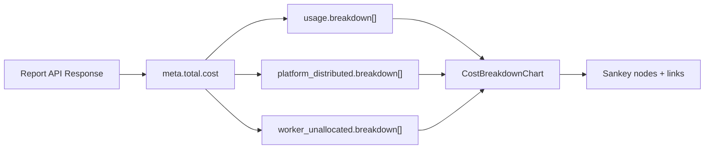

# Frontend Implementation: Cost Breakdown for Custom Costs (Phase 1)

**PRD Reference:** [PRD04 COST-2105 / COST-4415](https://github.com/project-koku/koku/blob/main/docs/architecture/prd04-cost-breakdown/README.md)
**Backend Detailed Design:** [DD04](https://github.com/project-koku/koku/blob/main/docs/architecture/prd04-cost-breakdown/DETAILED_DESIGN.md)
**Phase:** Phase 1 (COST-2105)
**Repository:** koku-ui (this repo)
**Last updated:** 2026-02-16

---

## Scope

Three PRD acceptance criteria (frontend):

1. Rate creation/editing form includes the `name` field (required, max 50 chars)
2. Sankey diagram renders individual rate names as nodes in the flow
3. Overhead nodes (platform distributed, worker unallocated, etc.) flow into constituent rate-name nodes on the right side

All work is in `apps/koku-ui-hccm/src/`.

---

## Part A: Rate Name Field in Cost Model Editor

The backend already enforces `name` as mandatory on `RateSerializer`. The frontend must send it and display it.

### A1. API types — add `name` to Rate interfaces

- `api/rates.ts`: Add `name: string` to `RateRequest` (line 6) and `Rate` (line 27). Both currently lack it.

### A2. Rate form state — add `name` to form data

- `routes/settings/costModels/components/rateForm/utils.tsx`:
  - Add `name: ''` to `initialRateFormData` (line 26)
  - Add `name: textHelpers.required` to `initialRateFormData.errors` (line 44)
  - In `genFormDataFromRate()` (line 90): populate `name: rate.name || ''` (line 142)
  - In `transformFormDataToRequest()` (line 185): add `name: rateFormData.name` to the returned object (line 213)
  - Add `nameErrors()` validation function: required, max 50 chars, unique within cost model

### A3. Rate form reducer — handle name updates

- `routes/settings/costModels/components/rateForm/useRateForm.tsx`:
  - Add `UPDATE_NAME` action type
  - Handle it in `rateFormReducer`: update `state.name` and `state.errors.name`

### A4. Rate form UI — render the name input

- `routes/settings/costModels/components/rateForm/rateForm.tsx`:
  - Add a `SimpleInput` for `name` (required, max 50 chars) rendered **above** the `description` field
  - The `name` field should be the first user-visible text input (it's the primary identifier)
  - Wire to `rateFormData.setName` / `rateFormData.name` / `rateFormData.errors.name`

### A5. Rate form submit validation

- `routes/settings/costModels/components/rateForm/canSubmit.tsx`:
  - Add `errors.name` to the `canSubmit` check (form cannot submit if `errors.name` is non-null)

### A6. Price list table — display name column

- `routes/settings/costModels/costModel/priceListTable.tsx`:
  - Add a "Name" column to the price list table (before the existing "Metric" column)
  - Read `rate.name` from the rate data

### A7. Localization

- `locales/messages.ts`:
  - Add messages: `rateName` ("Rate name"), `rateNameRequired` ("Rate name is required"), `rateNameTooLong` ("Rate name must be 50 characters or less"), `rateNameDuplicate` ("Rate name must be unique within this cost model")

### A8. Tests

- `routes/settings/costModels/components/rateForm/useRateForm.test.tsx`:
  - Add test: `UPDATE_NAME` sets name and clears error
  - Add test: `UPDATE_NAME` with empty string sets required error
  - Add test: `UPDATE_NAME` with >50 chars sets too-long error
  - Add test: `transformFormDataToRequest` includes `name` in output
  - Add test: `genFormDataFromRate` populates `name` from rate

---

## Part B: Sankey Diagram Per-Rate Breakdown

The backend API now returns `breakdown` arrays on cost categories. The Sankey must consume these to add a new "layer" of nodes on the right side.

### B1. API types — add `breakdown` to ReportValue

- `api/reports/report.ts`:
  - Add `BreakdownEntry` interface:

```typescript
export interface BreakdownEntry {
  name: string;
  source: 'rate' | 'service' | 'cloud' | 'other';
  value: number;
  units: string;
}
```

  - Extend `ReportValue` (line 3) to add `breakdown?: BreakdownEntry[]`

### B2. Sankey chart — consume breakdown data

- `routes/details/components/costBreakdownChart/costBreakdownChart.tsx`:
  - This is the main change. The current Sankey has 3 layers:
    - Left: cost categories (raw, markup, usage, overhead types)
    - Middle: workload cost / overhead cost
    - Right: total cost
  - After the change, it needs 4 layers:
    - Left: rate/service names (from `breakdown` arrays)
    - Middle-left: cost categories (raw, markup, usage, overhead types)
    - Middle-right: workload cost / overhead cost
    - Right: total cost

The flow should be as shown in the PRD:

```
Total cost --> Project ---------> JBoss subscription
           |                |---> Guest OS subscription
           |                |---> Quota charge
           |
           \-> Overhead cost --> Platform distributed ----> JBoss subscription
                            |                          |--> Quota charge
                            \--> Worker unallocated ----> JBoss subscription
```

Concretely, in `initDatum()`:

- Read `report.meta.total.cost.usage.breakdown` for usage breakdown entries
- Read `report.meta.total.cost.platform_distributed.breakdown` for platform overhead entries
- Read similar for `worker_unallocated_distributed`, `storage_unattributed_distributed`, `network_unattributed_distributed`, `gpu_unallocated_distributed`
- For each breakdown entry, create a Sankey **node** (if not already added) with the entry's `name`
- For each breakdown entry, create a Sankey **link** from the category node to the rate-name node with the entry's `value`
- Handle top-N: if there are many entries, show up to ~10 and aggregate remainder as "Other" (matching the backend's `breakdown_limit` behavior, but also handle it in the UI for visual clarity)

### B3. Sankey chart styles — accommodate more nodes

- `routes/details/components/costBreakdownChart/costBreakdownChart.styles.ts`:
  - Increase `chartHeight` from 332 to a dynamic value based on the number of breakdown entries (more rates = taller chart)
  - Adjust `right` margin to accommodate longer rate name labels

### B4. Sankey chart — pass breakdown_limit query parameter

The API accepts `breakdown_limit` as a query parameter to control top-N. When the Sankey is rendered, the report fetch should include this parameter.

- Trace data flow: `ocpBreakdown.tsx` -> report fetch -> `CostOverview` -> `CostBreakdownChart`
- In the report query construction (wherever `reportType: ReportType.cost` is used for the Sankey), add `breakdown_limit=10` (or a configurable value) to the query string
- This may be in `store/breakdown/costOverview/ocpCostOverviewWidgets.ts` or in the report query builder

### B5. Localization

- `locales/messages.ts`:
  - Add messages: `breakdownOther` ("Other"), `breakdownCloudCost` ("Cloud cost")
  - Update `costBreakdownAriaLabel` and `costBreakdownAriaDesc` to mention per-rate breakdown

### B6. Skeleton update

- `routes/details/components/costBreakdownChart/costBreakdownChart.tsx`:
  - Update `getSkeleton()` to show the new 4-layer structure with placeholder rate-name nodes

### B7. Tests

- Create test file `routes/details/components/costBreakdownChart/costBreakdownChart.test.tsx`:
  - Test: renders without breakdown data (backward compatibility — no `breakdown` field)
  - Test: renders usage breakdown entries as additional Sankey nodes and links
  - Test: renders overhead breakdown entries flowing from overhead categories to rate-name nodes
  - Test: handles empty breakdown arrays gracefully
  - Test: "Other" aggregation when many entries are present

---

## Part C: OCP-on-Cloud Perspectives

The backend `BreakdownMixin` now returns breakdown on OCP-on-cloud responses. The frontend already renders OCP-on-cloud cost overviews using the same `CostBreakdownChart` component. No additional frontend wiring is needed for AWS/Azure/GCP/All perspectives — the chart reads `report.meta.total.cost` generically.

Verify that:
- `awsOcpBreakdown`, `azureOcpBreakdown`, `gcpOcpBreakdown` routes use `CostBreakdownChart`
- The chart component handles breakdown arrays being absent (cloud-only data with no cost model)

---

## Architecture: New Sankey Data Flow



---

## Key Files Summary

| Change area | Files to modify |
|---|---|
| API types | `api/rates.ts`, `api/reports/report.ts` |
| Rate form state | `rateForm/utils.tsx`, `rateForm/useRateForm.tsx`, `rateForm/canSubmit.tsx` |
| Rate form UI | `rateForm/rateForm.tsx` |
| Price list table | `costModel/priceListTable.tsx` |
| Sankey chart | `costBreakdownChart/costBreakdownChart.tsx`, `costBreakdownChart.styles.ts` |
| Report query | `store/breakdown/costOverview/ocpCostOverviewWidgets.ts` (or query builder) |
| Localization | `locales/messages.ts` |
| Tests | `rateForm/useRateForm.test.tsx`, new `costBreakdownChart.test.tsx` |

---

## Backend Dependencies

The backend implementation is complete on branch `pgarciaq-prd04-cost-breakdown` in the `koku` repository. Key API changes the frontend depends on:

1. **Cost model API** — `POST/PUT /cost-models/` now requires `name` (string, max 50 chars) on each rate. `GET /cost-models/{uuid}/` returns `name` in each rate object.
2. **Report API** — `GET /reports/openshift/costs/` (and all OCP/OCP-on-cloud cost endpoints) now returns optional `breakdown` arrays on cost value objects (`usage`, `platform_distributed`, `worker_unallocated_distributed`, etc.). Each entry has `{name, source, value, units}`.
3. **Query parameter** — `breakdown_limit` (integer, 1-100) controls top-N limiting with "Other" aggregation.
